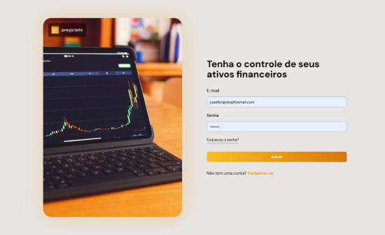
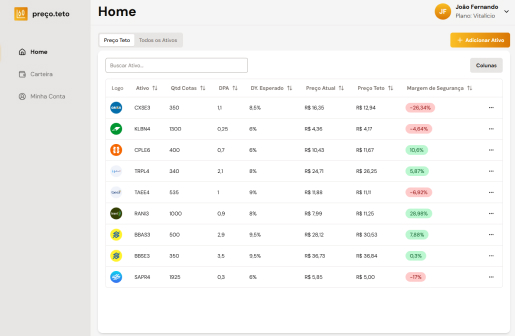
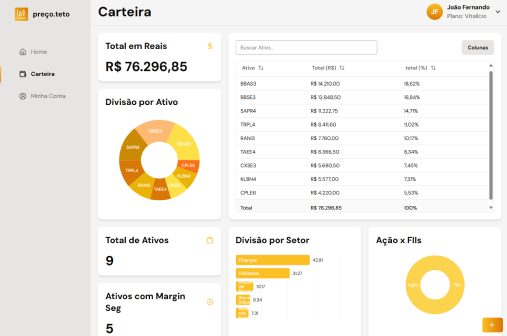

# Maxcota

Aplicação Web, em NextJS 14+, que auxilia investidores a realizarem o cálculo de preço teto de suas ações da bolsa de valores, além de fornecer algumas métricas da carteira cadastrada. Confira em: [maxcota.vercel.app](https://maxcota.vercel.app/)

### 🚀 Tecnologias utilizadas:

- Figma (UI/UX Design)
- NextJS
- React
- Tailwind
- Brapi
- ShadCn

##

### 📷 Algumas imagens...

